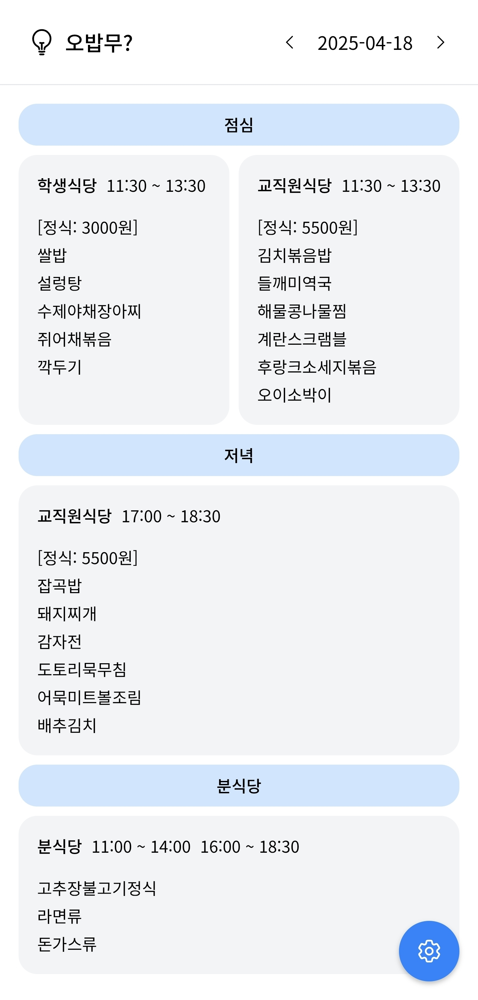
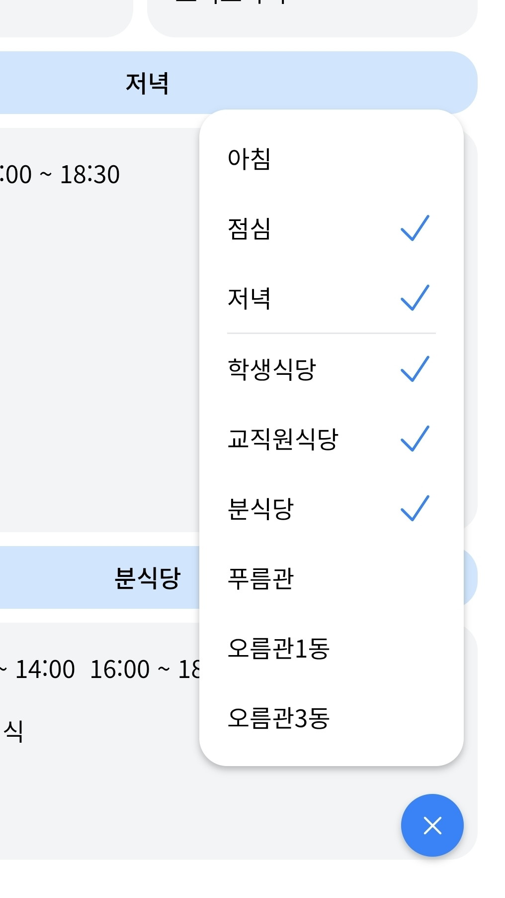

# 오밥무?

오늘 밥 무엇?

국립금오공과대학교 학식당/기숙사식당 식단표 사이트

<p>
  
  
</p>

## 시작하기

먼저 개발 서버를 실행하세요:

```bash
yarn dev
```

브라우저에서 [http://localhost:3000](http://localhost:3000) 을 열어 결과를 확인할 수 있습니다.

`app/page.tsx` 파일을 수정하여 페이지를 편집할 수 있으며, 파일을 수정하면 페이지가 자동으로 업데이트됩니다.

이 프로젝트는 [`next/font`](https://nextjs.org/docs/basic-features/font-optimization)를 사용하여 Google Fonts의 Noto Sans KR 폰트를 자동으로 최적화하고 불러옵니다.

## Vercel에 배포하기

Next.js 팀이 만든 [Vercel 플랫폼](https://vercel.com/new?utm_medium=default-template&filter=next.js&utm_source=create-next-app&utm_campaign=create-next-app-readme)을 사용하면 Next.js 앱을 가장 쉽게 배포할 수 있습니다.

배포에 대한 자세한 내용은 [Next.js 배포 문서](https://nextjs.org/docs/deployment)를 참고하세요.
